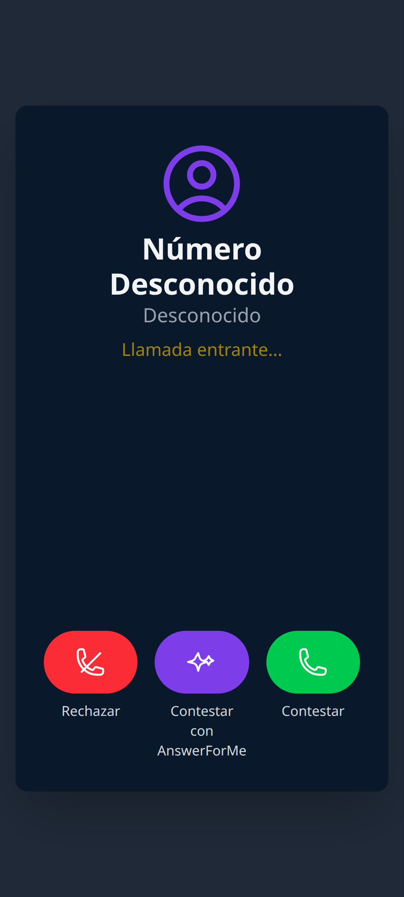
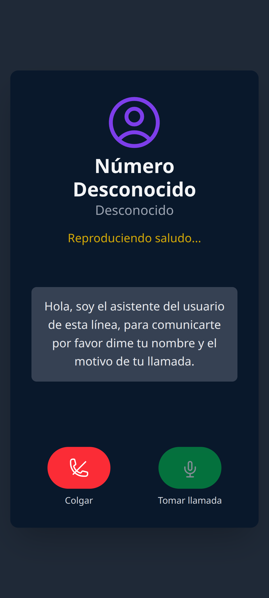
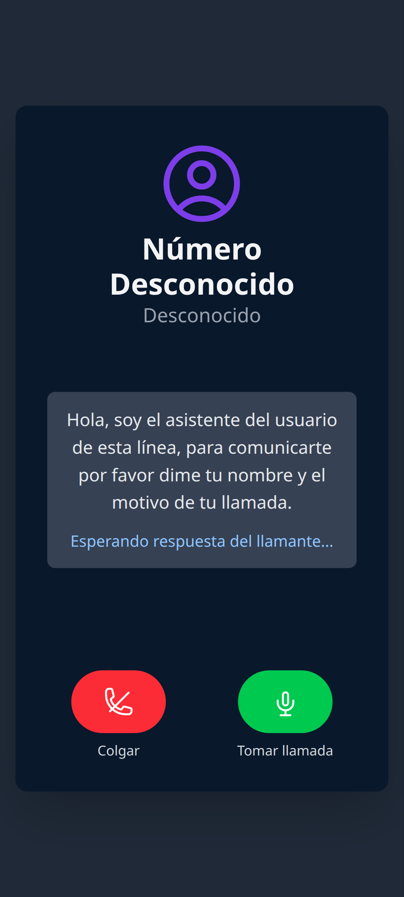
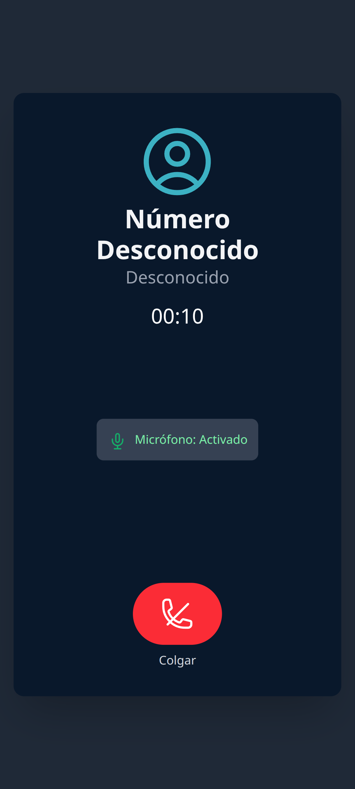
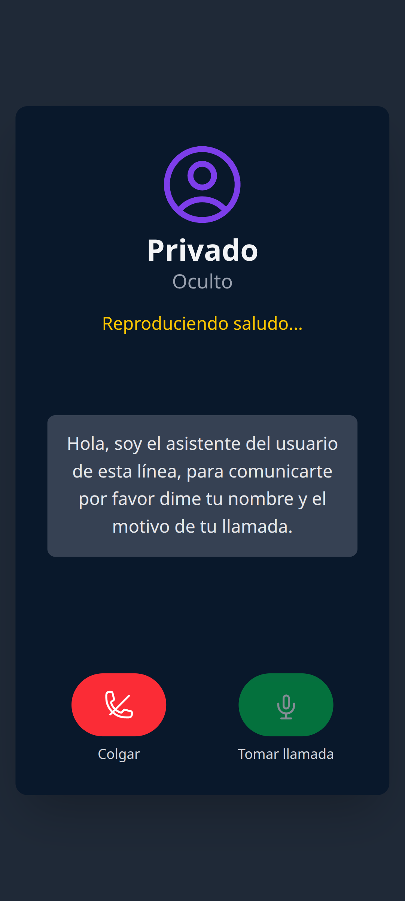

# AnswerForMe Call Assistant

<p align="center">
  
</p>

**AnswerForMe Call Assistant** es una aplicación React que simula una interfaz de llamadas telefónicas con funciones como contestar, rechazar y un asistente AI "AnswerForMe" que filtra llamadas por ti. Demuestra diferentes estados de llamada e interacción con el micrófono.

---

## 🚀 Propósito

El objetivo de AnswerForMe es ayudarte a filtrar llamadas desconocidas o sospechosas, permitiendo que un asistente AI interactúe primero con el llamante y te permita tomar el control solo si lo deseas.

## ✨ Características principales

- Simulación de llamada entrante con datos ficticios.
- Opción de contestar, rechazar o usar el asistente AI.
- El asistente AI reproduce un saludo y espera la respuesta del llamante.
- Puedes tomar el control de la llamada en cualquier momento.
- Indicador visual del estado del micrófono.
- Interfaz moderna y responsiva, con soporte para temas personalizados.
- Soporte multi-idioma (inglés y español) con preferencia persistente.

## 🖥️ Capturas de pantalla (Flujo de la app)

<p align="center">
  <b>1. Llamada entrante</b><br>
  
</p>
<p align="center">
  <b>2. Contestando con AnswerForMe (asistente AI)</b><br>
  
</p>
<p align="center">
  <b>3. Esperando respuesta del llamante</b><br>
  
</p>
<p align="center">
  <b>4. Tomando el control de la llamada</b><br>
  
</p>
<p align="center">
  <b>5. Llamada activa</b><br>
  
</p>

## ⚙️ Instalación y uso

**Requisitos:** Node.js

1. Instala las dependencias:
   ```bash
   npm install
   ```
2. Crea un archivo `.env.local` y coloca tu clave de API de Gemini:
   ```env
   GEMINI_API_KEY=tu_clave_aqui
   ```
3. Ejecuta la app:
   ```bash
   npm run dev
   ```

Abre [http://localhost:5173](http://localhost:5173) en tu navegador para ver la aplicación.

## 📱 PWA & Uso Offline

Esta aplicación ahora es una **Progressive Web App (PWA)** con soporte para ejecución offline básica.

### ¿Qué se añadió?
- `public/manifest.webmanifest`: Definición de nombre, colores y icono.
- `public/service-worker.js`: Gestiona caché y provee fallback offline.
- `public/offline.html`: Página mostrada cuando no hay conexión.
- Registro del Service Worker en `index.tsx` (solo en modo producción).

### Cómo probar modo PWA
1. Ejecuta el build:
  ```bash
  npm run build
  npm run preview
  ```
2. Abre la app en el navegador y espera a que se instale el Service Worker (unos segundos tras cargar).
3. Abre las DevTools → Application → Service Workers para verificar el registro.
4. Usa la opción "Add to Home Screen" (en móviles) o instala desde la barra del navegador (en Chrome/Edge).

### Prueba Offline
1. Tras el primer uso online, abre DevTools → Network y selecciona "Offline".
2. Refresca: verás la aplicación cargada desde caché. Para la raíz se intentará cargar lo último disponible.
3. Si una navegación falla, se mostrará `offline.html` como fallback.

### Notas técnicas
- Estrategia de navegación: network-first con fallback offline.
- Activos estáticos (JS/CSS/imágenes) usan cache-first con actualización cuando vuelve la conectividad.
- Puedes ajustar políticas en `public/service-worker.js`.

### Limitaciones actuales
- No se precachean los bundles con hash generados por Vite automáticamente. Para un precache completo se podría integrar Workbox o un plugin de inyección de manifiesto.
- El icono usa SVG; para mejor compatibilidad se recomienda añadir PNGs (192x192 y 512x512) en `public/` y referenciarlos en el manifest.

## 🛣️ Despliegue en subruta / Codespaces

Para funcionar tanto en GitHub Codespaces como en un servidor propio, la configuración admite una base dinámica. El valor por defecto ahora es la **raíz** (`/`). Solo necesitas establecer `VITE_BASE_PATH` si desplegarás en una subruta (por ejemplo `/answer-for-me/`).

1. (Opcional) Define la variable `VITE_BASE_PATH` antes de ejecutar si usarás subruta:
```bash
export VITE_BASE_PATH="/answer-for-me/"   # si despliegas bajo subdirectorio
export GEMINI_API_KEY="<tu_api_key>"
npm run dev
```
Para desarrollo o producción en raíz no necesitas exportar la variable, pero puedes hacerlo explícitamente:
```bash
export VITE_BASE_PATH="/"
npm run build
```
2. `vite.config.ts` ajusta automáticamente `base` garantizando la barra final.
3. El Service Worker y el manifest usan rutas relativas (`offline.html`, `assets/...`) para mantener el scope correcto.
4. El registro del Service Worker utiliza `import.meta.env.BASE_URL`.
5. Si cambias la subruta, considera incrementar `CACHE_NAME` en `public/service-worker.js` o limpiar caché del navegador.


## 🌐 Multi-idioma

La aplicación soporta actualmente **inglés** y **español**. Para cambiar el idioma:

1. Haz clic en el botón de engranaje (Configuración).
2. Selecciona el idioma deseado.
3. Tu preferencia se guarda automáticamente y se restaurará en visitas futuras.

Si tu navegador está en español y es tu primera visita, se iniciará en español; de lo contrario, en inglés.

## 📁 Estructura del proyecto

- `App.tsx`: Componente principal de la app.
- `components/`: Componentes de UI para los distintos estados de llamada.
- `assets/a4m-icon.svg`: Logo principal de la app.
- `constants.ts`: Textos y recursos de audio.
- `a4m-theme.css`: Tema visual y estilos personalizados.

## 📝 Licencia

Actualmente este proyecto no tiene una licencia definida. Si deseas contribuir o usarlo, por favor contacta al autor.

---

Desarrollado con ❤️ por Snoitan.
